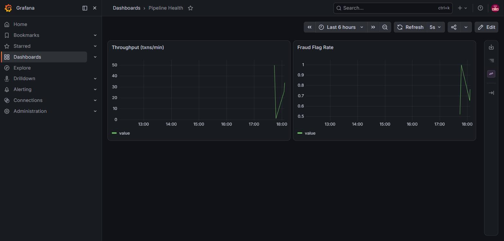
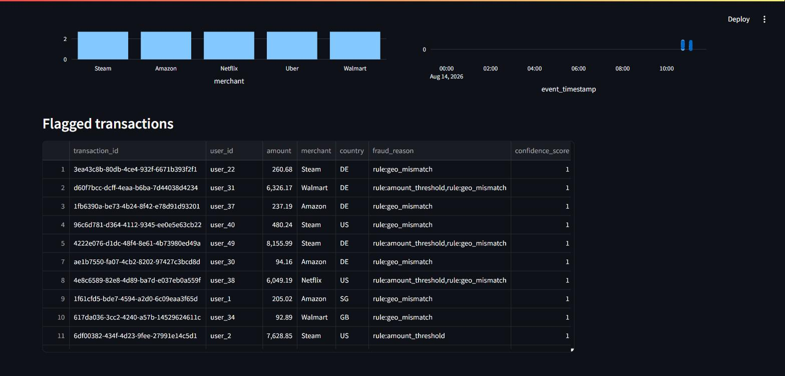

# Real-Time Event Pipeline — Fraud/Transaction Detection

[](https://www.python.org/)
[](docker-compose.yml)
[](LICENSE)

End-to-end real-time pipeline: stream ingestion, dual-mode fraud detection
(rule-based + ML), analytical storage, and two dashboards. Full design:
[docs/design/2026-08-14-real-time-event-pipeline-design.md](docs/design/2026-08-14-real-time-event-pipeline-design.md).

Key architectural decisions and their trade-offs are written up as ADRs in
[`docs/adr/`](docs/adr/):
[stream processing](docs/adr/0001-stream-processing-kafka-python-vs-flink-vs-ksqldb.md) ·
[storage](docs/adr/0002-storage-clickhouse-vs-postgres-vs-sqlite.md) ·
[fraud detection](docs/adr/0003-fraud-detection-rule-based-vs-ml-vs-combo.md) ·
[dashboards](docs/adr/0004-dashboards-grafana-plus-streamlit.md).

## Headline result

| Metric | Value |
|---|---|
| Fraud model | XGBoost, **precision 0.856 / recall 0.786** on the Kaggle held-out split |
| Release gate | `MIN_PRECISION` 0.80, `MIN_RECALL` 0.70 — training asserts the bar before a model is usable |
| Detection | Dual-mode: rules on the synthetic stream, ML on the dataset replay |
| Storage | ClickHouse, batched inserts, sustaining a demo burst of hundreds of events/sec |
| Dashboards | Grafana pipeline health · Streamlit fraud-analyst view |
| Tests | 49 tests |

The two modes are not redundancy — the synthetic generator emits
`amount`/`merchant`/`country`, while the Kaggle signal lives entirely in 28
anonymized PCA features specific to that dataset's originating bank. The
feature spaces do not overlap, so one strategy cannot score both sources.

The gate is measured at `ML_FRAUD_THRESHOLD`, the same constant the consumer
flags on. It previously used `model.predict`'s implicit 0.5 while the consumer
flagged at 0.7, so the gate certified an operating point the pipeline never
ran. Both now import one definition and a test asserts they agree. Four ADRs
in [`docs/adr/`](docs/adr/) record the stack decisions and their trade-offs.

## Architecture

```
[Synthetic Generator] ──┐
                         ├──> Kafka topic `transactions` ──> Python Consumer
[Dataset Replay (Kaggle  ┘        (confluent-kafka)
 credit card fraud CSV)]                  │
                              ┌───────────┴───────────┐
                              │  Rule-based check       │  (amount, velocity, geo)
                              │  ML model scoring        │  (XGBoost, replay-only)
                              └───────────┬───────────┘
                                          ▼
                                    ClickHouse (raw + flagged txn)
                                          │
                            ┌─────────────┴─────────────┐
                            ▼                             ▼
                        Grafana                    Streamlit + Plotly
                    (pipeline health)              (fraud analyst view)
```

## Run it

1. Download `creditcard.csv` from Kaggle's "Credit Card Fraud Detection"
   dataset into `ml/data/creditcard.csv`.
2. Train the model: `python -m ml.train ml/data/creditcard.csv ml/model.joblib`
3. `docker compose up -d`
4. Seed traffic:
   - Synthetic: `docker compose run --rm generator synthetic --rate 5 --fraud-ratio 0.05`
   - Replay: `docker compose run --rm generator replay --csv ml/data/creditcard.csv`
5. Grafana: http://localhost:3000 (pipeline health) · Streamlit: http://localhost:8501 (fraud analyst view)

## Tests

Unit tests (no external services required):

```
python -m venv .venv && .venv/Scripts/pip install -r consumer/requirements.txt -r generator/requirements.txt -r ml/requirements.txt pytest
.venv/Scripts/python -m pytest
```

Run pytest through the project's `.venv`, not a global interpreter. A global
Python without `confluent-kafka` / `clickhouse-connect` installed does not fail
with a clear `ModuleNotFoundError` here — `unittest.mock.patch` swallows the
missing-dependency import error while resolving its target, so
`mock.patch("generator.producer.Producer")` surfaces as
`AttributeError: module 'generator' has no attribute 'producer'` instead. It
reads like a broken test; it is the wrong interpreter.

Integration test (requires `docker compose up -d` first):

```
.venv/Scripts/python -m pytest -m integration
```

## Dashboards

**Grafana — pipeline health** (throughput, fraud flag rate)



**Streamlit — fraud analyst view** (flagged transactions by merchant, amount over time, drilldown table)


